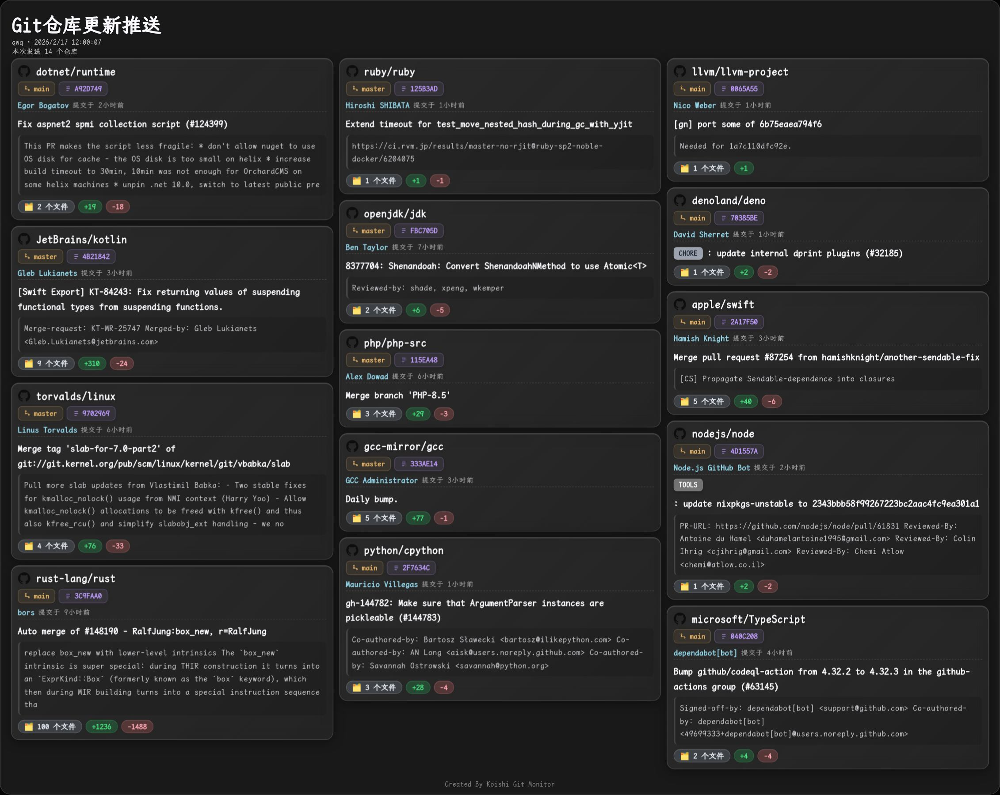

# koishi-plugin-git-repo-monitor

[](https://www.npmjs.com/package/koishi-plugin-git-repo-monitor)
[](https://www.npmjs.com/package/koishi-plugin-git-repo-monitor)
[](https://github.com/VincentZyuApps/koishi-plugin-git-repo-monitor)
[](https://gitee.com/vincent-zyu/koishi-plugin-git-repo-monitor)

<p>💬 插件使用问题 / 🐛 Bug反馈 / 👨‍💻 插件开发交流，欢迎加入QQ群：<b>1085190201</b> 🎉</p>
<p>💡 在群里直接艾特我，回复的更快哦~ ✨</p>

---

监控 Git 仓库变化并推送通知到指定频道，支持 Typst 渲染精美卡片。

## 效果预览



## 功能特性

- 🔄 **多仓库监控**: 支持同时监控多个 Git 仓库的提交和发布
- ⏰ **灵活定时**: 独立配置轮询间隔和推送间隔
- 🎨 **精美渲染**: 使用 Typst 渲染精美的更新通知卡片
- 📢 **多平台推送**: 支持推送到多个平台和频道
- 🔧 **高度可配置**: 灵活的配置项满足各种需求
- 📦 **模块化设计**: 清晰的代码结构，易于扩展和维护

## 可选依赖
- `puppeteer` - 浏览器排版截图服务
- `to-image-service` - 图片转换服务
- `w-node` - Node.js 模块加载支持

## 配置说明

### 基础配置

- **fontPath**: 字体文件绝对路径（推荐使用 LXGW WenKai Mono）
- **maxCommitsPerPush**: 单次推送最大显示提交数（默认 10）

### 监控组配置

每个监控组包含：

- **name**: 监控组名称（用于标识）
- **platform**: 推送平台（如 `onebot`）
- **channelId**: 推送频道 ID
- **repos**: 仓库列表
  - **url**: 仓库地址（支持 GitHub、Gitee 等）
  - **branch**: 分支名称（默认 `main`）
  - **type**: 监听类型（`commits` 或 `releases`）
- **pollCron**: 轮询 Cron 表达式（检查更新频率）
- **pushCron**: 推送 Cron 表达式（推送通知频率）

## 使用示例

```yaml
plugins:
  git-repo-monitor:
    fontPath: /path/to/LXGWWenKaiMono-Regular.ttf
    maxCommitsPerPush: 10
    monitorGroups:
      - name: Koishi 生态监控
        platform: onebot
        channelId: '123456789'
        repos:
          - url: https://github.com/koishijs/koishi
            branch: main
            type: commits
          - url: https://github.com/koishijs/koishi-plugin-puppeteer
            branch: main
            type: releases
        pollCron: '*/10 * * * *'  # 每 10 分钟检查一次
        pushCron: '0 */2 * * *'   # 每 2 小时推送一次
```

## 命令

| 指令 | 说明 | 示例 |
|------|------|------|
| `git-monitor` | 查看监控状态 | `git-monitor` |
| `git-monitor.check <组名>` | 手动触发检查 | `git-monitor.check qwq` |
| `git-monitor.push <组名> [-m mode]` | 手动触发推送<br>• `-m new` (默认): 仅推送新更新<br>• `-m last`: 强制推送最新状态 | `git-monitor.push qwq`<br>`git-monitor.push qwq -m last` |
| `git-monitor.list` | 列出所有监控仓库 | `git-monitor.list` |

## Cron 表达式

**常用示例：**

- `*/10 * * * *` - 每 10 分钟执行一次
- `0 */2 * * *` - 每 2 小时执行一次
- `0 9,12,18 * * *` - 每天 9:00、12:00、18:00 执行
- `0 0 * * *` - 每天 0:00 执行

**相关资源：**

- [【Crontab Guru】 - https://crontab.guru/](https://crontab.guru/) - 在线 Cron 表达式编辑器和可视化工具
- [【Cronitor Cron Jobs Guide】 - https://cronitor.io/guides/cron-jobs](https://cronitor.io/guides/cron-jobs) - Cron 任务完整指南
- [【Man Page: crontab(5)】 - https://man7.org/linux/man-pages/man5/crontab.5.html](https://man7.org/linux/man-pages/man5/crontab.5.html) - Crontab 官方文档
- [【Wikipedia: Cron】 - https://en.wikipedia.org/wiki/Cron](https://en.wikipedia.org/wiki/Cron) - Cron 维基百科

## 数据库设计

插件使用 Koishi 内置数据库维护两张表：

### 1. `git_repo_state` (仓库状态表)

| 字段 | 类型 | 说明 |
|------|------|------|
| id | unsigned | 主键自增 |
| repoUrl | string | 仓库地址 |
| branch | string | 分支名 |
| lastCheckpoint | string | 上次检查点（ISO 时间戳） |
| lastUpdated | timestamp | 上次更新时间 |

**作用**：记录每个仓库的监控进度，实现增量更新检测。  
**约束**：`repoUrl` + `branch` 组合唯一。

### 2. `git_push_record` (推送记录表)

| 字段 | 类型 | 说明 |
|------|------|------|
| id | unsigned | 主键自增 |
| groupName | string | 监控组名 |
| platform | string | 推送平台 |
| channelId | string | 频道 ID |
| repoUrl | string | 仓库地址 |
| content | text | 推送内容摘要 |
| pushedAt | timestamp | 推送时间 |

**作用**：记录历史推送行为，用于审计。

## 更新检测机制 (New 模式)

为了在轮询和 `new` 模式推送下准确获取增量更新，插件采用以下逻辑：

1. **基准获取**：从 `git_repo_state` 表中读取该仓库对应分支的 `lastCheckpoint`（通常是 ISO 时间戳）。
2. **API 请求**：调用 GitHub/Gitee API 时，将 `lastCheckpoint` 作为 `since` 参数传递，请求该时间点之后的数据。
3. **精准过滤**：由于 API 返回的数据可能包含 `since` 时间点本身的提交，插件会在内存中进行二次过滤：
   ```typescript
   // 过滤掉 <= 上次检查点的提交
   const newCommits = rawCommits.filter(c => c.date.getTime() > checkpointTime)
   ```
4. **状态更新**：一旦确认有新提交并准备推送，将最新一条 Commit 的时间戳更新回数据库，作为下一次检查的基准。
5. **首次运行 (Silent Start)**：如果是第一次添加仓库（无数据库记录）：
   - 默认开启 `silentStart`：仅将最新 Commit 记录为 Checkpoint，**不发送推送**，防止刚添加时刷屏。
   - 关闭 `silentStart`：将最新一条 Commit 视为更新并推送。

## 架构设计

```
src/
├── index.ts           # 插件入口
├── config.ts          # 配置定义
├── types.ts           # 类型定义
├── services/
│   ├── git.ts         # Git 服务
│   └── renderer.ts    # Typst 渲染服务
├── scheduler/
│   ├── poller.ts      # 轮询调度器
│   └── pusher.ts      # 推送调度器
└── utils/
    ├── formatter.ts   # 数据格式化
    └── storage.ts     # 数据存储
```

## 分支名检查机制

插件在获取仓库提交时会进行智能的分支名回退处理：

| 配置的分支 | 找不到时的行为 | 错误信息示例 |
|-----------|--------------|-------------|
| `main` | 自动尝试 `master` | `分支 "main" 和备用分支 "master" 均不存在` |
| `master` | 自动尝试 `main` | `分支 "master" 和备用分支 "main" 均不存在` |
| 其他分支 | 直接报错，不尝试回退 | `分支 "canary" 不存在（仅 main/master 支持自动回退）` |

**设计理念**：
- 由于不同仓库的默认分支命名习惯不同（GitHub 新仓库默认 `main`，老仓库多为 `master`），插件会自动在这两者之间回退
- 对于用户明确指定的其他分支（如 `develop`、`canary`、`v2` 等），不进行回退，直接报错以提示用户检查配置

## License

GPL-3.0

### 致谢

本项目的设计灵感来源于 [【DF-Plugin】 - https://gitee.com/DenFengLai/DF-Plugin](https://gitee.com/DenFengLai/DF-Plugin)，感谢原作者的开源贡献。

按照惯例，本项目遵循上游的 GPL-3.0 协议并开源。
