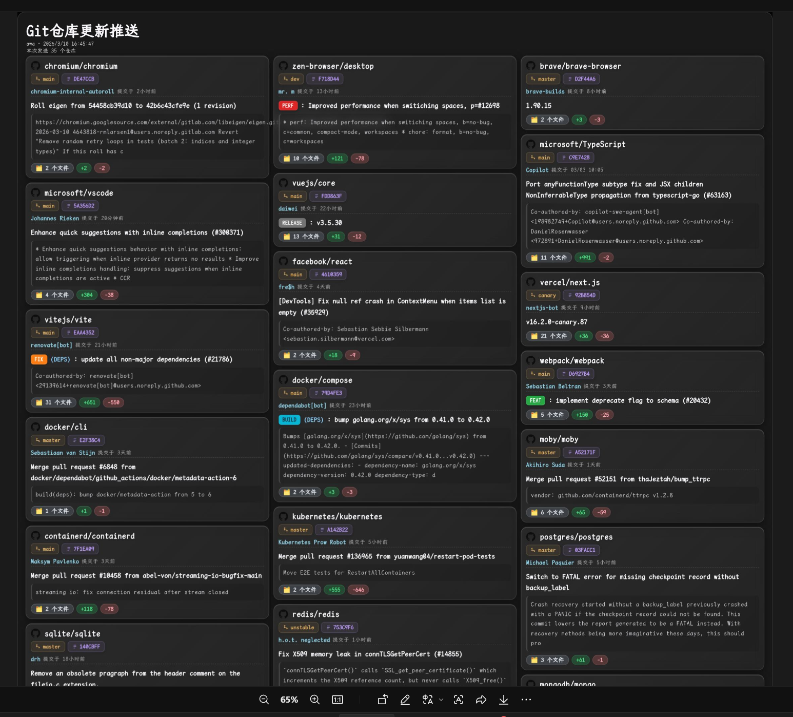
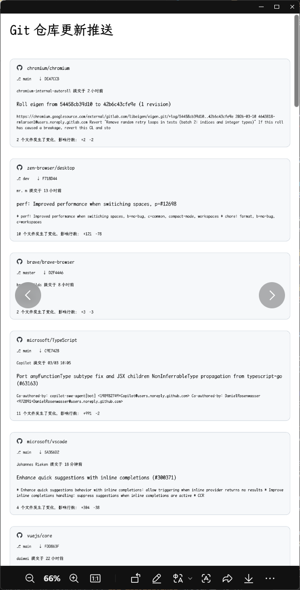
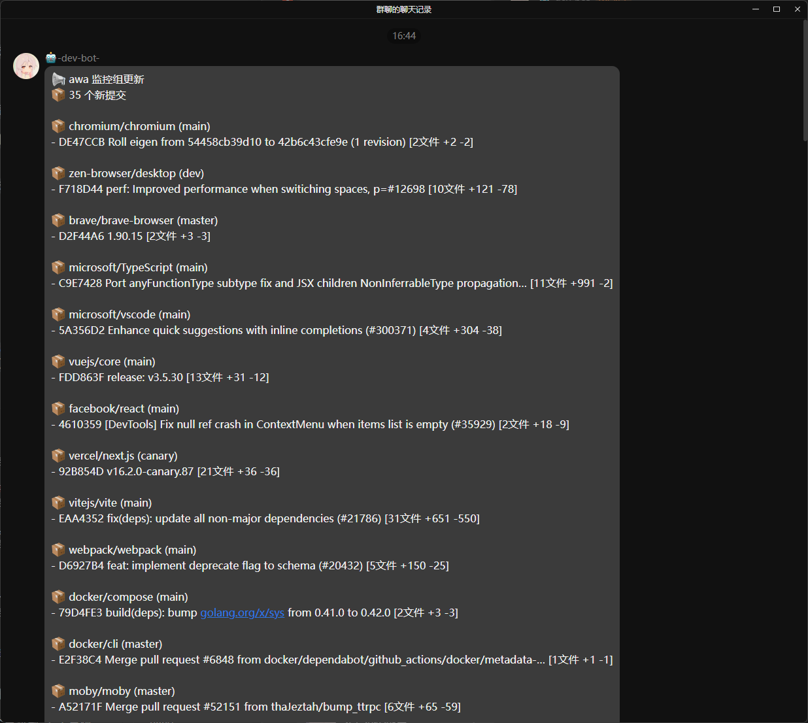

# koishi-plugin-git-repo-monitor

[](https://www.npmjs.com/package/koishi-plugin-git-repo-monitor)
[](https://www.npmjs.com/package/koishi-plugin-git-repo-monitor)
[](https://github.com/VincentZyuApps/koishi-plugin-git-repo-monitor)
[](https://gitee.com/vincent-zyu/koishi-plugin-git-repo-monitor)

<p><del>💬 插件使用问题 / 🐛 Bug反馈 / 👨‍💻 插件开发交流，欢迎加入QQ群：<b>259248174</b>   🎉（这个群G了</del> </p> 
<p>💬 插件使用问题 / 🐛 Bug反馈 / 👨‍💻 插件开发交流，欢迎加入QQ群：<b>1085190201</b> 🎉</p>
<p>💡 在群里直接艾特我，回复的更快哦~ ✨</p>

---

# 监控 Git 仓库变化并推送通知到指定频道，🎨 支持 Typst 和 puppeteer 渲染图片卡片， 📦目前支持Github 和 Gitee

## 效果预览

### Puppeteer 渲染（瀑布流布局）



> 💡 **Puppeteer 渲染**：样式更精美，但出图较慢，占用资源较多

### Typst 渲染



> ⚡ **Typst 渲染**：出图快速，节省资源，但样式相对简单

### 合并转发（Forward）



> 📨 **合并转发**：仅支持 OneBot 平台，将多条消息合并为一条转发消息

## 功能特性

- 🔄 **多仓库监控**: 支持同时监控多个 Git 仓库的提交和发布
- ⏰ **灵活定时**: 独立配置轮询间隔和主动消息推送间隔
- 🎨 **精美渲染**: 使用 Typst 渲染精美的更新通知卡片
- 📢 **多平台推送**: 支持推送到多个平台和频道
- 🔧 **高度可配置**: 灵活的配置项满足各种需求
- 📦 **模块化设计**: 清晰的代码结构，易于扩展和维护
- 🔎 **动态发现**: 从 GitHub/Gitee 用户/组织主页自动解析仓库列表，支持自动同步
- 📊 **仓库排序**: 支持时间降序/升序、字母降序/升序四种排序方式
- 💬 **主动/被动消息**: 按 QQ 官方 Bot 语境区分定时主动推送和指令被动响应

## 可选依赖

- `database` - 数据库服务（必需）
- `puppeteer` - Puppeteer 图片渲染（模式：puppeteer-image）
- `to-image-service >= 0.1.5` + `w-node >= 2.0.0` - Typst 图片渲染（模式：typst-image），Typst 编译器固定使用 `@myriaddreamin/typst-ts-node-compiler@0.7.0`
- `onebot` - 合并转发功能（模式：forward）

## 内置资源缓存

插件启动时会自动把包内置的 `assets` 目录复制到 Koishi 根目录下的固定路径：

```text
ctx.baseDir/data/assets/git-repo-monitor
```

Puppeteer 与 Typst 渲染会优先从该目录读取 GitHub/Gitee 图标资源；如果同步失败，会回退到插件包内置资源目录。该路径不需要配置项。

## 字体下载缓存

插件可自动下载并校验默认字体 `LXGWWenKaiMono-Regular.ttf`，用于 Puppeteer 与 Typst 图片渲染。

```text
ctx.baseDir/data/fonts/LXGWWenKaiMono-Regular.ttf
```

配置页里的默认 `fontPath` 会展示为 `process.cwd()/data/fonts/LXGWWenKaiMono-Regular.ttf`，这是因为 Koishi Schema 阶段拿不到 `ctx.baseDir`；运行时会自动映射到 `ctx.baseDir/data/fonts/LXGWWenKaiMono-Regular.ttf`。下载顺序为 **Gitee release 优先**，失败后 fallback 到 **GitHub release**，下载后会校验 `size + md5 + sha1 + sha256 + sha512`。

- Gitee: <https://gitee.com/vincent-zyu/koishi-plugin-awa-quote-image/releases/download/fonts/LXGWWenKaiMono-Regular.ttf>
- GitHub: <https://github.com/VincentZyuApps/koishi-plugin-awa-quote-image/releases/download/fonts/LXGWWenKaiMono-Regular.ttf>

## 主动消息与被动消息

本插件按 QQ 官方 Bot 语境区分主动消息和被动消息：

- **主动消息 (`active`)**：Bot 不依赖当前用户指令，按 `pushCron` 定时主动推送待推送队列，使用 `activeOutputModes`。
- **被动消息 (`passive`)**：用户执行指令触发，例如 `git-monitor.push` / `git-monitor.dryrun`，使用 `passiveOutputModes`。
- **轮询检查 (`pollCron`)**：只负责检查仓库更新并加入待推送队列，不直接发送消息。

## 配置说明

### 基础配置

- **maxCommitsPerPush**: 单次推送最大显示提交数（默认 10）
- **useFirstBotWhenSelfIdEmpty**: 推送目标未指定 selfId 时的 Bot 选择策略（默认 true：同平台 Bot 逐个尝试，首个成功即停止；关闭后对所有同平台 Bot 发送）
- **showStats**: 是否显示代码行数变化统计（+/-），默认 true
- **silentStart**: 首次运行是否静默（默认 true，防止首次添加仓库时刷屏）
- **parallelFetchCount**: 并行获取仓库数量（默认 8，设为 1 则串行）
- **repoSortOrder**: 仓库卡片排序方式（time-desc(默认)/time-asc/alpha-asc/alpha-desc）
- **repoFetchTimeout**: 单仓库 API 请求超时毫秒数（默认 300000 = 5 分钟）
- **immediatePollOnStart**: 启动时是否立即执行一次轮询（默认 false）

### 字体下载配置

- **enableFontDownload**: 是否自动下载默认字体（默认 true）。
- **fontPath**: 默认字体路径，配置页默认展示 `process.cwd()/data/fonts/LXGWWenKaiMono-Regular.ttf`，运行时映射到 `ctx.baseDir/data/fonts/LXGWWenKaiMono-Regular.ttf`。
- **typstFontPath**: Typst 字体路径覆盖项，留空使用 `fontPath`。
- **puppeteerFontPath**: Puppeteer 字体路径覆盖项，留空使用 `fontPath`。

### 触发与输出模式

- **activeOutputModes**: 主动消息输出形式，Bot 按 `pushCron` 定时主动推送时使用。
- **passiveOutputModes**: 被动消息输出形式，用户执行 `git-monitor.push` / `git-monitor.dryrun` 指令时使用。
- **defaultPushMode**: `git-monitor.push` 未指定 `-m` 参数时使用的默认模式。
  - `new`: 推送当前待推送队列中的新更新，不重新拉取所有仓库。
  - `last`: 即时拉取所有仓库最新状态，并作为被动消息发送。

### 监控组配置

每个监控组包含：

- **name**: 监控组名称（用于标识，⚠️ 必须唯一）
- **pushTargets**: 推送目标列表（支持多个推送目标）
  - **name**: 推送目标名称（用于标识）
  - **platform**: 推送平台（如 `onebot`、`discord` 等）
  - **channelId**: 推送频道 ID
  - **enabled**: 是否启用此推送目标（默认 true）
  - 当前 `pushTargets` 不配置 `selfId`；同平台多个 Bot 的选择由全局 `useFirstBotWhenSelfIdEmpty` 控制
- **repos**: 仓库列表
  - **url**: 仓库地址（支持 GitHub、Gitee 等）
  - **branch**: 分支名称（默认 `main`）
  - **type**: 监听类型（`commits` 或 `releases`）
- **pollCron**: 轮询 Cron 表达式（检查更新频率；发现的新更新会加入待推送队列，不直接发送）
- **pushCron**: 主动消息推送 Cron 表达式（Bot 定时主动发送待推送队列的频率）
- **enabled**: 是否启用此监控组（默认 true）

## 使用示例

```yaml
plugins:
  git-repo-monitor:
    enableFontDownload: true
    fontPath: ./data/fonts/LXGWWenKaiMono-Regular.ttf
    typstFontPath: ''
    puppeteerFontPath: ''
    maxCommitsPerPush: 10
    monitorGroups:
      - name: Koishi 生态监控
        pushTargets:
          - name: QQ群推送
            platform: onebot
            channelId: '123456789'
            enabled: true
          - name: Discord推送
            platform: discord
            channelId: '987654321'
            enabled: true
        repos:
          - url: https://github.com/koishijs/koishi
            branch: main
            type: commits
          - url: https://github.com/koishijs/koishi-plugin-puppeteer
            branch: main
            type: releases
        pollCron: '*/10 * * * *'  # 每 10 分钟检查一次，发现新更新后加入待推送队列
        pushCron: '0 */2 * * *'   # 每 2 小时发送一次主动消息
        enabled: true
```

## 命令

| 指令 | 说明 | 示例 |
|------|------|------|
| `git-monitor` | 查看监控状态 | `git-monitor` |
| `git-monitor.check <组名>` | 指令触发检查<br>发现的新更新会加入待推送队列，不会立即发送 | `git-monitor.check qwq` |
| `git-monitor.discover <urls> [-n name] [--no-sync]` | 从 GitHub/Gitee 用户或组织创建动态监控组<br>• `-n <名称>`: 指定组名<br>• `--no-sync`: 创建后不同步仓库列表 | `git-monitor.discover https://github.com/owner1`<br>`git-monitor.discover https://github.com/owner1 -n my-group` |
| `git-monitor.dryrun [-n count]` | 使用硬编码假数据测试被动消息推送与渲染<br>• `-n <数量>`: 指定仓库数量 (1-30)<br>• 默认 15 个仓库 | `git-monitor.dryrun`<br>`git-monitor.dryrun -n 20` |
| `git-monitor.inspect <组名> [-p page] [-l limit] [-s sort] [-v]` | 查看监控组仓库详情<br>• `-p <页码>`: 页码 (默认1)<br>• `-l <数量>`: 每页条数 (默认10)<br>• `-s <方式>`: time-desc(默认)/time-asc/alpha-asc/alpha-desc<br>• `-v`: 显示最新 commit 详情 | `git-monitor.inspect qwq`<br>`git-monitor.inspect qwq -p 2 -l 20 -s alpha-asc` |
| `git-monitor.list [--verbose]` | 列出所有监控组概要<br>• `--verbose`: 显示全部仓库详情（⚠️可能超限） | `git-monitor.list`<br>`git-monitor.list --verbose` |
| `git-monitor.push <组名> [-m mode]` | 触发一次被动消息推送<br>• 未指定 `-m` 时使用 `defaultPushMode`（默认 `last`）<br>• `-m new`: 发送当前待推送队列，不重新拉取所有仓库<br>• `-m last`: 即时拉取所有仓库最新状态并发送 | `git-monitor.push qwq`<br>`git-monitor.push qwq -m last` |

## Cron 表达式

**常用示例：**

- `*/10 * * * *` - 每 10 分钟执行一次
- `0 */2 * * *` - 每 2 小时执行一次
- `0 9,12,18 * * *` - 每天 9:00、12:00、18:00 执行
- `0 0 * * *` - 每天 0:00 执行

**相关资源：**

- [【Crontab Guru】 - https://crontab.guru/](https://crontab.guru/) - 在线 Cron 表达式编辑器和可视化工具
- [【Cronitor Cron Jobs Guide】 - https://cronitor.io/guides/cron-jobs](https://cronitor.io/guides/cron-jobs) - Cron 任务完整指南
- [【Man Page: crontab(5)】 - https://man7.org/linux/man-pages/man5/crontab.5.html](https://man7.org/linux/man-pages/man5/crontab.5.html) - Crontab 官方文档
- [【Wikipedia: Cron】 - https://en.wikipedia.org/wiki/Cron](https://en.wikipedia.org/wiki/Cron) - Cron 维基百科

## 数据库设计

插件使用 Koishi 内置数据库维护两张表：

### 1. `git_repo_state` (仓库状态表)

| 字段 | 类型 | 说明 |
|------|------|------|
| id | unsigned | 主键自增 |
| repoUrl | string | 仓库地址 |
| branch | string | 分支名 |
| lastCheckpoint | string | 上次检查点（ISO 时间戳） |
| lastUpdated | timestamp | 上次更新时间 |

**作用**：记录每个仓库的监控进度，实现增量更新检测。  
**约束**：`repoUrl` + `branch` 组合唯一。

### 2. `git_push_record` (推送记录表)

| 字段 | 类型 | 说明 |
|------|------|------|
| id | unsigned | 主键自增 |
| groupName | string | 监控组名 |
| platform | string | 推送平台 |
| channelId | string | 频道 ID |
| repoUrl | string | 仓库地址 |
| content | text | 推送内容摘要 |
| pushedAt | timestamp | 推送时间 |

**作用**：记录历史推送行为，用于审计。

## 更新检测机制 (New 模式)

为了在轮询和 `new` 模式推送下准确获取增量更新，插件采用以下逻辑：

1. **基准获取**：从 `git_repo_state` 表中读取该仓库对应分支的 `lastCheckpoint`（最新 Commit SHA 或 ISO 时间戳）。
2. **API 请求**：调用 GitHub/Gitee API 时，将 `lastCheckpoint` 作为 `since` 参数传递，请求该时间点之后的数据。
3. **精准过滤**：由于 API 返回的数据可能包含 `since` 时间点本身的提交，插件会在内存中进行二次过滤：
   ```typescript
   // 过滤掉 <= 上次检查点的提交
   const newCommits = rawCommits.filter(c => c.date.getTime() > checkpointTime)
   ```
4. **状态更新**：检查阶段一旦确认有新提交，就将最新一条 Commit 的 SHA 或时间戳更新回数据库，并把更新加入待推送队列。
5. **首次运行 (Silent Start)**：如果是第一次添加仓库（无数据库记录）：
   - 默认开启 `silentStart`：仅将最新 Commit 记录为 Checkpoint，**不加入待推送队列**，防止刚添加时刷屏。
   - 关闭 `silentStart`：将最新一条 Commit 视为更新并加入待推送队列。

## 架构设计

```
src/
├── index.ts              # 插件入口
├── config.ts             # 配置定义
├── types.ts              # 类型定义
├── render/
│   ├── typst.ts       # Typst 渲染服务
│   ├── puppeteer.ts   # Puppeteer 渲染服务
│   ├── forward.ts     # 合并转发服务
│   └── text.ts        # 文本渲染服务
├── services/
│   ├── discover.ts       # 动态发现服务
│   └── git.ts            # Git API 服务
├── scheduler/
│   ├── poller.ts         # 轮询检查/待推送队列调度器
│   └── pusher.ts         # 主动/被动消息推送调度器
└── utils/
    ├── assets.ts         # 内置资源缓存
    ├── fonts.ts          # 字体下载与运行时路径解析
    ├── storage.ts        # 数据存储
    ├── file.ts           # 文件日志工具
    └── format.ts         # 格式化工具
```

## 分支名检查机制

插件在获取仓库提交时会进行智能的分支名回退处理：

| 配置的分支 | 找不到时的行为 | 错误信息示例 |
|-----------|--------------|-------------|
| `main` | 自动尝试 `master` | `分支 "main" 和备用分支 "master" 均不存在` |
| `master` | 自动尝试 `main` | `分支 "master" 和备用分支 "main" 均不存在` |
| 其他分支 | 直接报错，不尝试回退 | `分支 "canary" 不存在（仅 main/master 支持自动回退）` |

**设计理念**：
- 由于不同仓库的默认分支命名习惯不同（GitHub 新仓库默认 `main`，老仓库多为 `master`），插件会自动在这两者之间回退
- 对于用户明确指定的其他分支（如 `develop`、`canary`、`v2` 等），不进行回退，直接报错以提示用户检查配置

## License

GPL-3.0

### 致谢

本项目的设计灵感来源于 [【DF-Plugin】 - https://gitee.com/DenFengLai/DF-Plugin](https://gitee.com/DenFengLai/DF-Plugin)，感谢原作者的开源贡献。

按照惯例，本项目遵循上游的 GPL-3.0 协议并开源。
